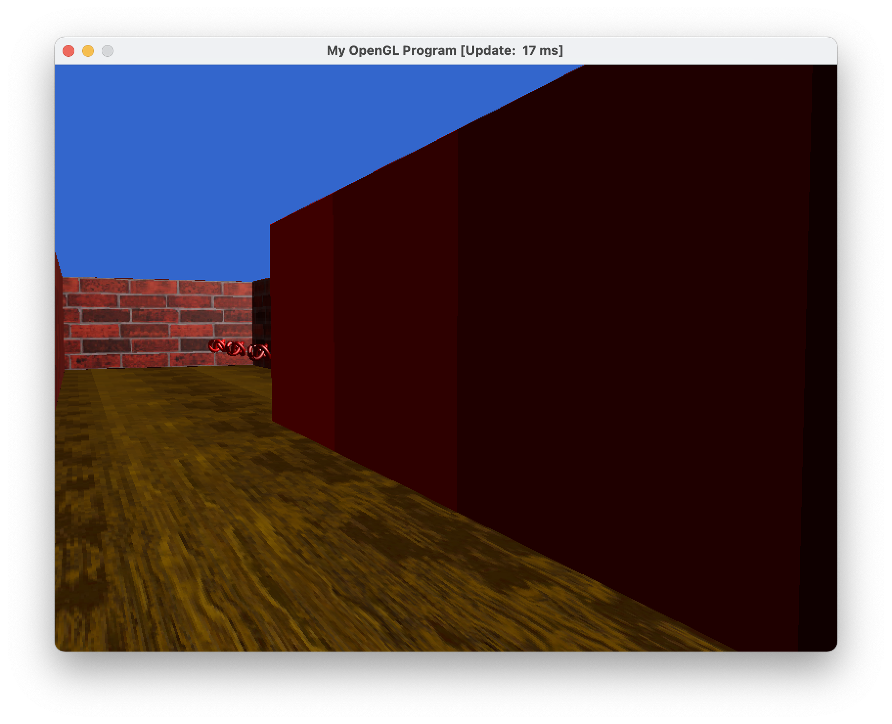
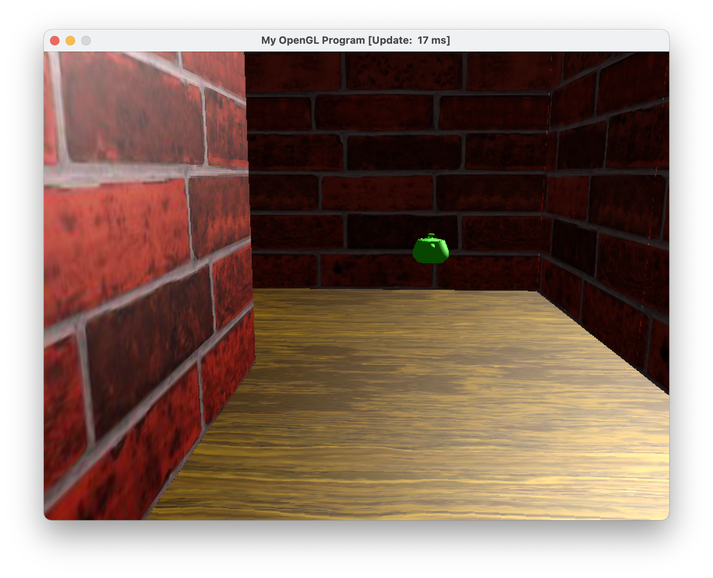
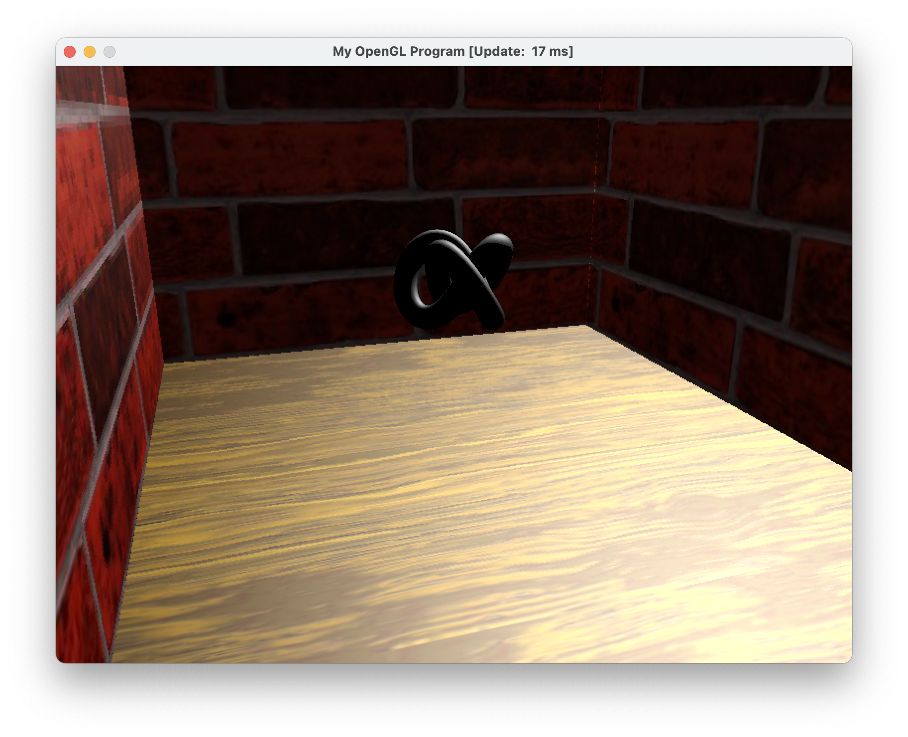
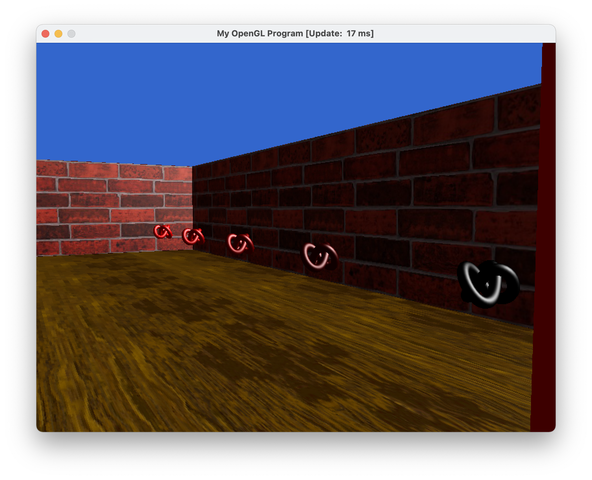
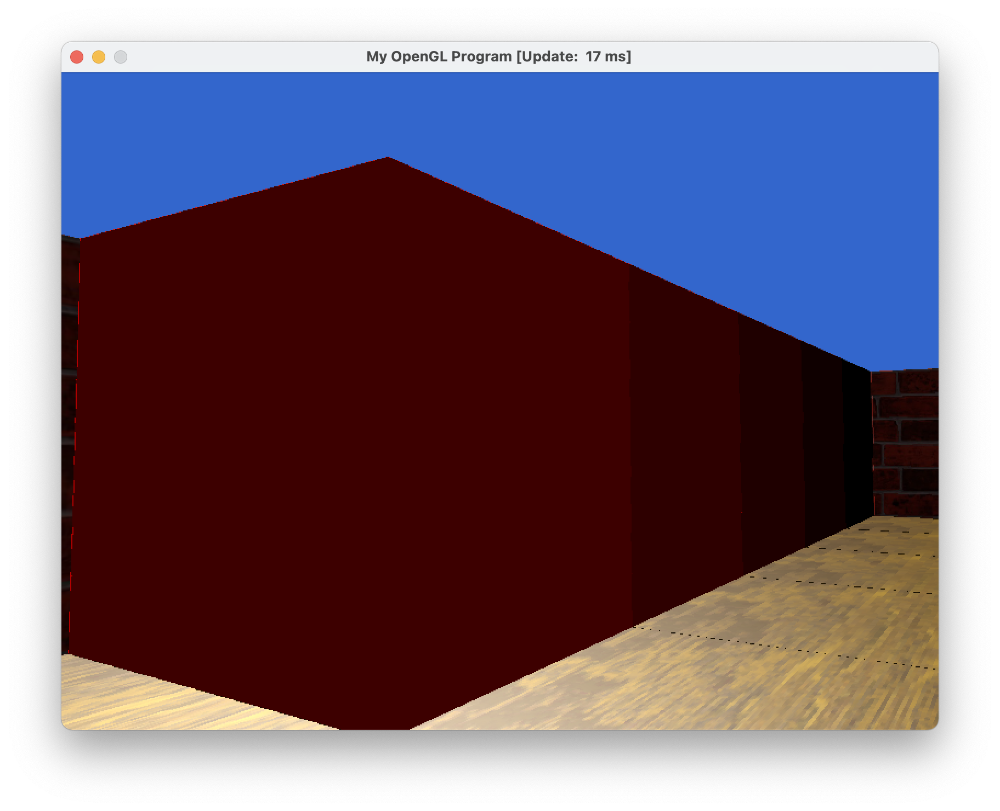
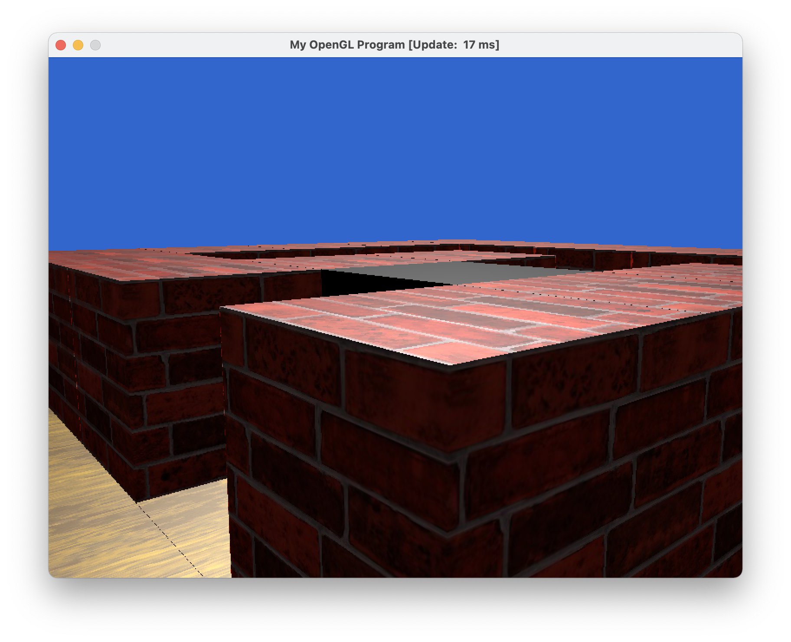

# Computer Graphics 5607 Project 4

## Screenshots


<p align="center">
  
  
  
  
  
  
</p>


## Example Level

- This is the example level
```text
5 5
0000G
WW0W0
0WAW0
0W0WW
S000a
```

However, I modified it to add walls around it:
```text
7 7
WWWWWWW
W0000GW
WWW0W0W
W0WAW0W
W0W0WWW
WS000aW
WWWWWWW
```


### Playthrough


### Collision


## Checklist

### Basic

- [x] Continuous Movement
- [x] Walls & Doors (each of five doors and keys look consecutively more red)
- [x] Keys (and rendering in front)
- [x] User Input
- [x] Collision Detection
- [x] Floors
- [x] Lighting
- [x] New Map

### Additional

- [x] Texture map
- [x] Keyboard and mouse control
- [x] Jumping
- [x] Video (webp video at start)

## New Maps

### Impossible Map

There is no end to this map, but it shows off all the walls and keys!
```text
4 12
WWWW
WSAW
W0BW
W0CW
W0DW
W0EW
W0aW
W0bW
W0cW
W0dW
W0eW
WWWW
```

<p align="center">
  
</p>


## Implementation

I started off with the example `MultiObjectTextures` code 
and started modifying it heavily. To help me understand the code, 
I created a wrapper around many of the OpenGL functions. I then 
composed the wrappers I created around primitives to create a game which
looks and feels very nice compared to what my expectations 
were.

### Issues

I don't believe I have any issues in the code now,
but I experienced a lot of dumb mistakes. One such issue was
I was doing matrix multiplication in the wrong order.