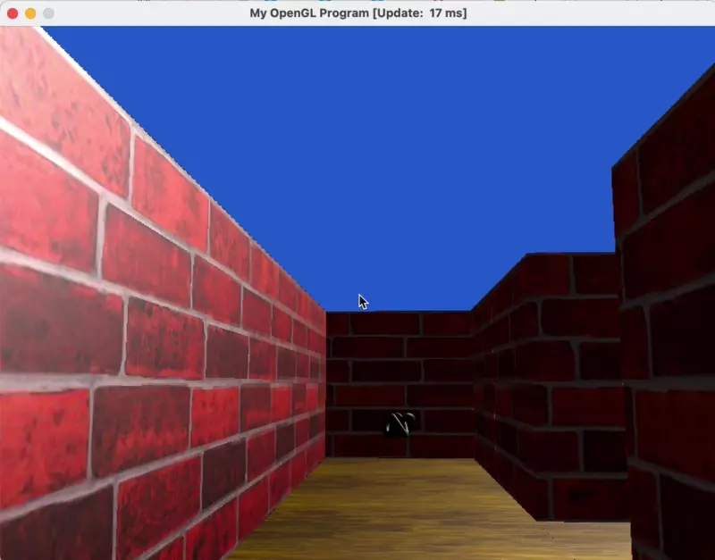
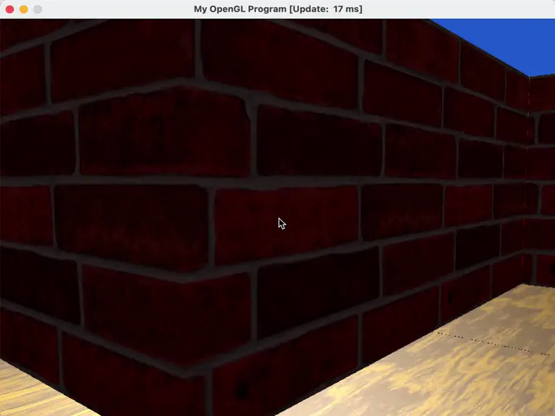

# Computer Graphics 5607 Project 4

## Example Level

- This is the example level
```text
5 5
0000G
WW0W0
0WAW0
0W0WW
S000a
```

However, I modified it to add walls around it:
```text
7 7
WWWWWWW
W0000GW
WWW0W0W
W0WAW0W
W0W0WWW
WS000aW
WWWWWWW
```


### Playthrough


### Collision


## Checklist

### Basic

- [x] Continuous Movement
- [x] Walls & Doors (each of five doors and keys look consecutively more red)
- [x] Keys (and rendering in front)
- [x] User Input
- [x] Collision Detection
- [x] Floors
- [x] Lighting
- [x] New Map

### Additional

- [x] Texture map
- [x] Keyboard and mouse control
- [x] Jumping
- [x] Video (webp video at start)

## New Maps